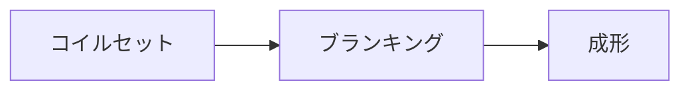
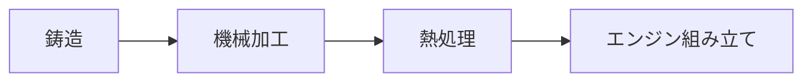

# 工場での生産工程を見て

## プレス

長い鉄の板を切って圧力をかけ、車体やドアなど車を構成するパーツを作成

### めも

- 鋼板の品質保証
  - 品質要求は年々厳しくなっている
  - 特定の用途に対して使用する鋼板が満足すべき結果とな
    るためには、発注者が鋼板の特性をよく理解し、製造者も
    鋼板の用途、使用条件について熟知したうえで、発注者の
    微妙な要求内容を受注材の品質設計ならびに製造工程に反
    映させることが望ましい。(日本鉄鋼協会：厚板マニュアル）)
- 検査保証方法
  - 工場保証
    - 注文品について取決めた仕様内容にしたがって製造者が製品を検査し、保証する方法で、発注者の要求によって鋼材検査証明書（Inspection Certificate一般にミルシートといわれている）が発行される
  - 第3者機関による保証
    - 公に認められた第3者の検査機関に検査を依頼し、その機関が検査を行い、品質保証を行う方法である

## 溶接

## 塗装

目視？による塗装検査あり
ムラがある場合はポリッシャーで均一になるよう磨く

## エンジン

エンジンの検査(ミクロン単位)

## 組み立て→検査

600項目以上の検査
運転したときの感覚や目などの職人技でチェック
電子部品のチェックは専用の機械で行われる

